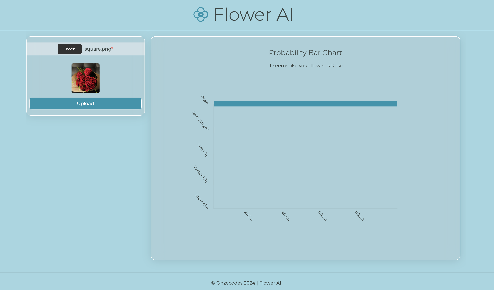

# Flower AI
An Artificial Intelligence software to identify flowers


## Overview
This  Application demonstrates my expertise in artificial intelligence and software development by creating an advanced image classifier. It's purpose is to identify flower species using a dataset of high-resolution images annotated with 102 distinct categories. Each image is crucial for training the convolutional neural network (CNN), ensuring precise classification of various flower types.

Utilizing PyTorch, the project implements machine learning algorithms and computer vision techniques. PyTorch enables the extraction of intricate features from the dataset, thereby enhancing accuracy in flower classification.

For seamless interaction, Flask is used to create APIs that connect the trained model. React is employed to develop a responsive frontend interface, enabling users to upload images, receive  flower species identification, and visualize classification results intuitively.


## Technologies used.
- Python 
- Pytorch
- Flask
- Javascript
- React

## Steps to run
1. ensure that you've python sand npm installed
1. Install requirements 
 - Backend
 ```cd  backend && pip install -r requirements.txt```
- FrontEnd
    ```cd frontend && npm install ```
2. Train the classifier using train.py to  gernerate the checkpoint file (optional) - the provided checkpoint file uses the VGG11 model
3. run server.py
    ```cd  backend && python3 server.py```
4. run the frontend
    ```cd frontend && npm run start ```
5. enjoy.


## Visuals
